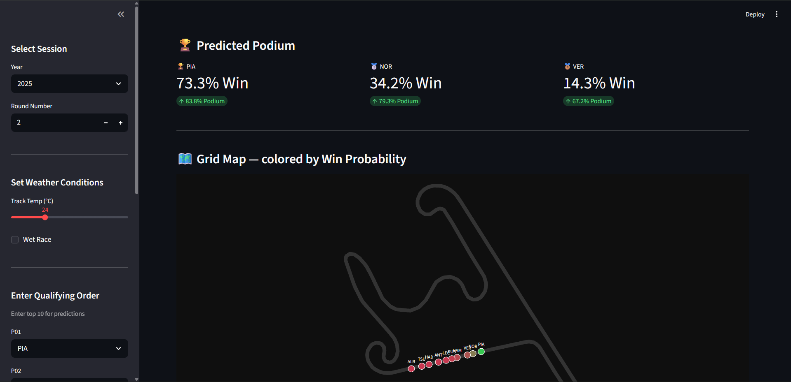
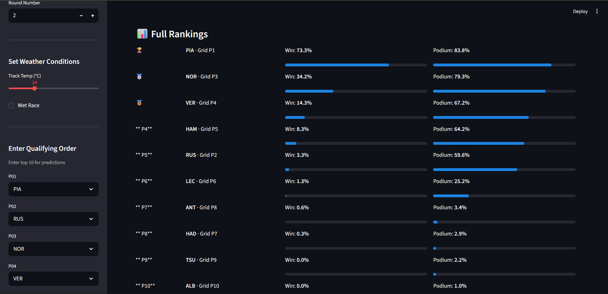
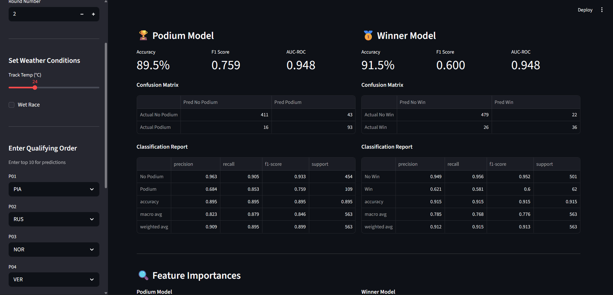

# F1 Race Prediction & Visualization System

A full-stack machine learning project that predicts Formula 1 podium 
finishers and race winners using real telemetry data, with a live race 
replay simulation and an autonomous AI driver.


---
## Screenshots

### Pre-Race Predictions & Track Map


### Full Driver Rankings


### Model Accuracy Dashboard


---

## What It Does

- **Predicts podium finishers and race winners** using two separate 
  Random Forest models trained on 3+ seasons of real F1 data
- **Serves predictions** through a Streamlit web app with qualifying 
  order input, race condition settings, and a model accuracy dashboard
- **Replays real races** in a live Arcade simulation with actual GPS 
  telemetry from FastF1 — cars move around the real circuit lap by lap
- **Updates predictions live** during the replay as race positions evolve
- **Autonomous AI driver** — a Deep Q-Network (DQN) ported from C++ 
  drives around real F1 circuits using LIDAR sensors

---

## Results

| Model | Accuracy | F1 Score | AUC-ROC |
|-------|----------|----------|---------|
| Podium (Top 3) | 94% | 0.86 | ~0.93 |
| Winner (P1) | 87% | 0.55 | ~0.85 |

---

## Tech Stack

| Area | Tools |
|------|-------|
| Data Collection | FastF1, Pandas |
| Machine Learning | Scikit-learn (Random Forest) |
| AI Driver | PyTorch (DQN), LIDAR ray casting |
| Web UI | Streamlit, Plotly |
| Simulation | Python Arcade, NumPy |
| Version Control | Git, GitHub |

---

## Project Structure

```
f1podiumpredictor/
├── app.py                  # Streamlit web app
├── main.py                 # Full pipeline runner
├── replay.py               # Arcade race replay entry point
├── multiclass.py           # Optional P1-P20 position predictor
│
├── f1predictor/            # Core ML package
│   ├── collect.py          # FastF1 data collection
│   ├── features.py         # Feature engineering
│   ├── train.py            # Model training (podium + winner)
│   └── predict.py          # Prediction logic
│
├── src/                    # Replay + AI modules
│   ├── arcade_window.py    # Main Arcade window
│   ├── replay_data.py      # Lap position loader
│   ├── live_predict.py     # In-race prediction updates
│   ├── ai_driver.py        # DQN agent (PyTorch)
│   └── ai_track.py         # F1 circuit surface + LIDAR
│
├── models/
│   └── best_time.pt        # Trained DQN model
├── data/                   # Generated after running pipeline
└── model/                  # Generated after training
```

---

## Setup

### 1. Clone the repo
```bash
git clone https://github.com/sarthak-codes11/f1podiumpredictor.git
cd f1podiumpredictor
```

### 2. Install dependencies
```bash
pip install -r requirements.txt
pip install torch --index-url https://download.pytorch.org/whl/cpu
```

### 3. Collect data and train models
```bash
python main.py
```
> This collects 3 seasons of F1 data from the FastF1 API and trains 
> both models. Takes 15–30 minutes due to API rate limits.

### 4. If you already have data, skip collection
```bash
python main.py --skip-collect
```

---

## Usage

### Streamlit Predictions App
```bash
streamlit run app.py
```
- Enter qualifying order and race conditions
- Get win % and podium % for each driver
- Check model accuracy, confusion matrices, and feature importances

### Race Replay Simulation
```bash
python replay.py --year 2024 --round 12
```

**Replay Controls**

| Key | Action |
|-----|--------|
| `TAB` | Switch between F1 Replay and AI Driver mode |
| `SPACE` | Pause / Resume (replay) or Restart AI (AI mode) |
| `← / →` | Step back / forward one lap |
| `↑ / ↓` | Change playback speed |
| `1–5` | Set speed directly (0.25x to 4x) |
| `L` | Toggle LIDAR rays (AI mode) |
| `R` | Restart replay from lap 1 |

---

## Features Used by the Models

| Feature | Description |
|---------|-------------|
| `grid_pos` | Starting grid position |
| `quali_pos` | Qualifying position |
| `avg_finish_last3` | Rolling avg finishing position (last 3 races) |
| `avg_quali_last3` | Rolling avg qualifying position (last 3 races) |
| `track_temp` | Race day track temperature |
| `is_wet` | Binary wet/dry race flag |
| `driver_id` | Encoded driver identifier |
| `team_id` | Encoded constructor identifier |
| `circuit_podium_rate` | Driver's historical podium rate at this circuit |
| `cumulative_podiums` | Podiums accumulated this season (championship form) |

---

## How the Models Work

Two separate Random Forest classifiers are trained:

**Podium Model** — predicts whether a driver finishes in the top 3.
Class imbalance is handled with `class_weight={0:1, 1:6}` since only
3 of 20 drivers podium per race. Decision threshold set to 0.4.

**Winner Model** — predicts whether a driver wins the race.
Far rarer event (1 in 20), so uses `class_weight={0:1, 1:55}` and
a lower decision threshold of 0.3 to avoid always predicting "no win".

Both models use a time-ordered train/test split — trained on older 
seasons and tested on newer ones — to prevent data leakage.

---

## AI Driver

The AI driver is a Deep Q-Network trained in C++ using Raylib and 
ported to Python for inference. It uses a 23-dimensional state space:

- Speed, heading (sin/cos), normalized position (5 dims)
- 13 short-range LIDAR rays for wall danger detection
- 5 long-range LIDAR rays for corner anticipation

The agent drives around real F1 circuit centerlines extracted from 
FastF1 telemetry, with wall detection based on distance to the 
circuit edge rather than pixel colors.

---

## Disclaimer

Data is sourced from the FastF1 library which accesses publicly 
available F1 timing data. This project is for educational purposes only.
Formula 1 and related trademarks are property of their respective owners.